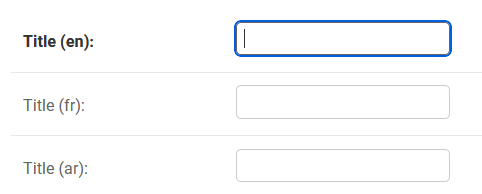
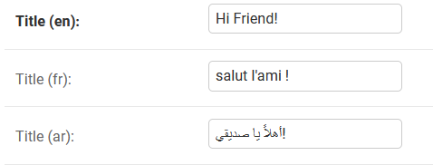

# Custom JSONField View in Django Admin
This is a sample application to store a text in different languages using JSONField and view the 
values as different fields in Django Admin

- [Installation](#installation)
- [Usage](#usage)
- [Screenshots](#Screenshots)

## Installation

- Create an environment with python 3.9 
- Use pip to install the required packages from requirements.txt
- Activate the environment
- Modify the database credentials in .env
- Run migrate

## Usage

- Use `JsonFieldWithTranslation` class in `CustomFields.py` 
instead of normal `JSONField` to know the whether separate fields need to be
created based on language codes.
- While registering models in admin, create new admin model for the corresponding model which 
inherits the properties and function from `CustomModelAdmin` defined in `CustomAdmin.py`

## Screenshots

